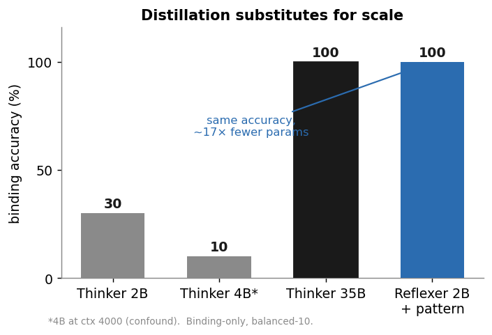
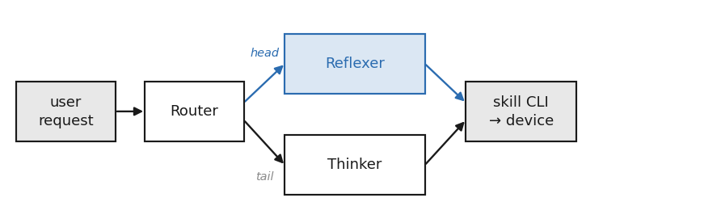
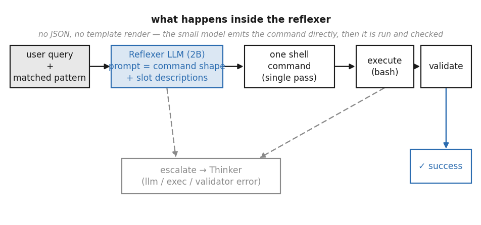

# A.L.F.R.E.D.

### Adaptive Local-First Routing and Execution Distillation for Small Language Models

**A local-first, two-tier router for on-device intent execution.** Most things you
ask a phone to *do* — set an alarm, dim the screen, toggle Wi-Fi, place a call —
don't need a model to *reason*; they need a model to *fill in a blank*. A.L.F.R.E.D.
sends those to a tiny on-device **reflexer** (a 2B model that fills a distilled
command pattern in a single forward pass) and escalates the rest to a heavier
**thinker** (an agent loop).

> **The result, in one line:** a 2B reflexer with a distilled pattern matches a
> **17× larger** free-form agent on binding (both 100%), while the same 2B without
> the pattern manages 30%. On a realistic device API, **scale buys discovery, not
> convention** — and a distilled pattern carries the convention.



## The idea in three bullets

- **Two tiers.** A router splits each request: deterministic, repeatable intents →
  reflexer; everything else → thinker.
- **The reflexer is an executioner, not a generator.** It does not decide *what* to
  do; it slot-fills a command shape supplied by a distilled pattern and runs it.
- **Symbolic distillation.** A strong teacher compresses device conventions into an
  inspectable JSON *pattern* once, offline; the cheap on-device model applies it
  forever. (Knowledge distillation into an artifact, not into weights — so it stays
  plug-and-play.)

## Architecture




## Reproduce a headline in one command

See [REPRODUCE.md](REPRODUCE.md). Quick start:

```bash
pip install -e .
make setup          # stage example patterns into ./data/patterns
python thesis/figures/make_figures.py            # regenerate all figures
tsx benchmarks/SET-2/run.ts --mode reflexer --model qwen-3.5-2b   # needs a local model
```

A local OpenAI-compatible endpoint is required for model runs (see
[REPRODUCE.md](REPRODUCE.md) for the exact `llama.cpp` serving config: Q4, temp 0.2,
reasoning disabled). Figure generation and benchmark *preflight* need no model.

## Results (every number traces to a saved run in `benchmarks/reports/`)

| Result | Number | Where |
|---|---|---|
| Binding: 2B+pattern = 35B thinker; 2B alone | 100% / 100% / 30% | `docs/findings_thinker_vs_reflexer.md` |
| Reflexer model sweep (ministral 3B → qwen 2B) | 95.6% → **100%** | `docs/findings_reflexer_model_comparison.md` |
| Clean vs realistic API (efficiency vs accuracy) | +65pp / 25%→ | `docs/findings_settings_distillation.md` |
| Limit of scale: even 35B fails conventions | 62.5% | `docs/findings_settings_distillation.md` |
| Cold-start distillation; teacher quality | 25%→76–80%; 80% vs 60% | `docs/findings_teacher_model.md` |

## Layout

```
alfred/runtime/    router · reflexer · dispatcher · store · llm_client · validators
alfred/skills/     14 mock skills (clock, media, device_settings, … docker, ffmpeg, …)
benchmarks/        SET-1 (clean API) · SET-2 (realistic Android API) · reports/
patterns/          distilled patterns (cloud vs local teacher) + expansion patterns
thesis/            the full bachelor thesis (PDF + LaTeX source)
docs/              findings reports
```

## What's withheld

This is the public, runnable distillation of a larger private system. For privacy,
the **account-coupled skills** (calendar, email, contacts, messaging, etc.) are not
included; the published skills are self-contained mocks that exercise the same
routing and binding paths.

## Citation

If you use this work, please cite the thesis — see [CITATION.cff](CITATION.cff).

## License

MIT © 2026 David Zoidze.
